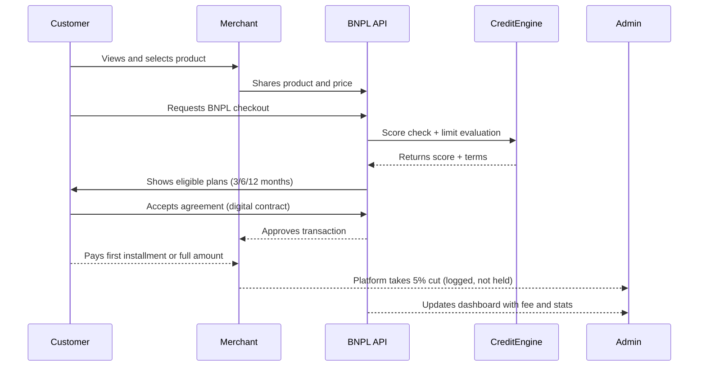

# 💳 TechOps Apex – Buy Now, Pay Later (BNPL) Platform

**BNPL Payment Solution** is a flexible, credit-aware platform that allows **merchants to list products**, **customers to buy instantly or on credit**, and **admins to monitor platform-wide financial flows and commission fees**. Designed for inclusion and scalability, this BNPL system gives customers purchasing power while empowering merchants with fast, direct payments.

---

---

## 🧩 Key Features

- 🛍️ **Merchant Product Listings** — Merchants post and manage products via a dashboard  
- 💳 **Buy Now, Pay Later Agreements** — Flexible 3, 6, or 12-month repayment plans with fair interest  
- 🧠 **Dynamic Credit Scoring** — Behavioral + API-based scoring for real-time credit decisions  
- 🤝 **Digital Contracts** — E-signed agreements for every deferred payment  
- 📊 **Merchant Dashboard** — Track orders, repayments, customer eligibility  
- 📱 **Customer App** — View credit limit, installment schedule, payment history  
- 🧾 **Admin Console** — Track system-wide metrics and **5% platform fee earnings**

---

## 💰 How Payments Work

- 💼 **Merchants receive funds directly** from customers at checkout
- 🏦 A **5% platform fee** is automatically calculated and reflected to the **Admin dashboard**
- 💸 Admins do not manage pooled funds but **earn per transaction**, commission-style

---

## 📆 Installment Plans & Interest Rates

| Duration     | Interest Rate | Description                    |
|--------------|----------------|--------------------------------|
| 🗓️ 3 Months  | **5%**         | Short-term, low-risk           |
| 🗓️ 6 Months  | **9%**         | Balanced repayment duration    |
| 🗓️ 12 Months | **15%**        | Extended term, higher flexibility |

All rates are clearly shown to the customer prior to contract signing.

---

## 🔁 BNPL Agreement Workflow

---

## 🧪 Tech Stack

| Layer           | Technology                        |
|-----------------|------------------------------------|
| Backend         | FastAPI / Node.js                 |
| Frontend        | React (Merchant), Flutter (Customer) |
| Credit Engine   | ML scoring models, external APIs  |
| Storage         | PostgreSQL, Redis                 |
| Contracts       | IPFS or cloud + e-signature       |
| Payments        | Stripe, Flutterwave, Paystack     |
| Notifications   | Twilio (SMS), SendGrid (Email)    |

---

## 🧱 Key Modules

### 1. 🧠 Credit Score Engine
- Pulls behavioral and API financial data
- Determines installment eligibility + dynamic credit limit
- Rewards responsible behavior with better rates

### 2. 🤝 Agreement Engine
- Generates digital contracts with repayment schedules
- Tracks installments, penalties, and contract status
- All agreements are securely stored and auditable

### 3. 💸 Payment System
- Customer pays merchant directly
- 5% transaction fee charged to merchant, logged to Admin
- No fund holding by platform — frictionless and fast

### 4. 📊 Merchant Dashboard
- Product inventory and pricing
- Track customer agreement statuses
- See platform fees paid

### 5. 📱 Customer Portal
- View credit usage and repayment calendar
- Get notifications and credit limit updates
- Track performance history and score progression

### 6. 🧾 Admin Console
- See platform-wide sales and total earned fees
- Manage fee rates, scoring thresholds, and activity logs
- No need for fund custody or disbursement

---

## 🔐 Security & Compliance

- Encrypted contract data + secure agreement signing
- PCI-DSS-compliant payment integrations
- Biometric and 2FA options
- GDPR/CCPA compliance
- Real-time audit logging and rate-limiting

---

## 🚀 What’s Next

- [ ] AI-driven fraud detection for early defaults
- [ ] Tap-to-BNPL via NFC for POS systems
- [ ] Micro-insurance upsell during checkout
- [ ] Loyalty & credit-building rewards

---

## 📜 License

MIT License — [LICENSE](LICENSE)

---

## 💬 Contact Us

- GitHub: [github.com/teambits009](https://github.com/teambits009)
- Email: [brandon@techopsapex.com](mailto:brandon@techopsapex.com)
- LinkedIn: [TechOps Apex](https://linkedin.com/company/techopsapex)

---

> _“We’re not just building credit — we’re building confidence.”_

Made with 💙 by **TechOps Apex — Fintech Division**

---
