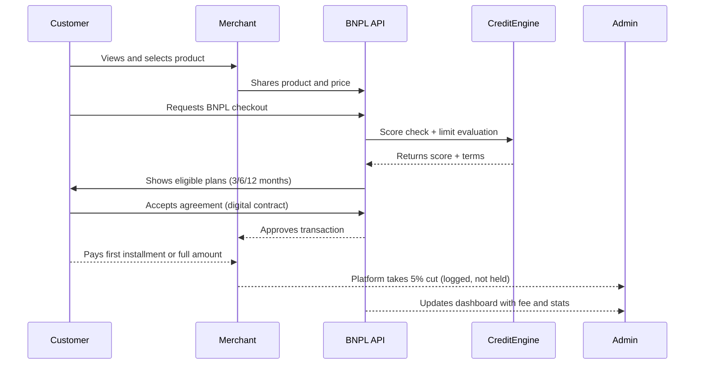

# 💳 Safari Gamers – Buy Now, Pay Later (BNPL) Platform

**Safari Gamers BNPL Platform** is a flexible, credit-aware solution that enables **merchants to list products**, **customers to purchase instantly or on credit**, and **admins to monitor platform-wide financial flows and commission fees**. Designed for inclusivity and scalability, this BNPL system empowers customers with purchasing power while providing merchants with fast, direct payments.

---

---

## 🧩 Key Features

* 🛍️ **Merchant Product Listings** — Merchants can post and manage products via a dedicated dashboard.
* 💳 **Buy Now, Pay Later Agreements** — Offers flexible 3, 6, or 12-month repayment plans with transparent interest rates.
* 🧠 **Dynamic Credit Scoring** — Combines behavioral data and external API-based scoring for real-time credit decisions.
* 🤝 **Digital Contracts** — Generates e-signed agreements for every deferred payment.
* 📊 **Merchant Dashboard** — Allows tracking of orders, repayments, and customer eligibility.
* 📱 **Customer App** — Enables viewing of credit limits, installment schedules, and payment history.
* 🧾 **Admin Console** — Provides oversight of system-wide metrics and 5% platform fee earnings.

---

## 💰 Payment Workflow

* 💼 **Direct Merchant Payments** — Merchants receive funds directly from customers at checkout.
* 🏦 **Platform Fee** — A 5% platform fee is automatically calculated and reflected in the Admin dashboard.
* 💸 **Commission-Based Earnings** — Admins earn per transaction without managing pooled funds.

---

## 📆 Installment Plans & Interest Rates

| Duration      | Interest Rate | Description                       |
| ------------- | ------------- | --------------------------------- |
| 🗓️ 3 Months  | **5%**        | Short-term, low-risk              |
| 🗓️ 6 Months  | **9%**        | Balanced repayment duration       |
| 🗓️ 12 Months | **15%**       | Extended term, higher flexibility |

All rates are clearly presented to the customer prior to contract signing.

---

## 🔁 BNPL Agreement Workflow

```mermaid
sequenceDiagram
  participant Customer
  participant Merchant
  participant BNPL API
  participant CreditEngine
  participant Admin

  Customer->>Merchant: Views and selects product
  Merchant->>BNPL API: Shares product and price
  Customer->>BNPL API: Requests BNPL checkout
  BNPL API->>CreditEngine: Score check + limit evaluation
  CreditEngine-->>BNPL API: Returns score + terms
  BNPL API->>Customer: Shows eligible plans (3/6/12 months)
  Customer->>BNPL API: Accepts agreement (digital contract)
  BNPL API-->>Merchant: Approves transaction
  Customer-->>Merchant: Pays first installment or full amount
  Merchant-->>Admin: Platform takes 5% cut (logged, not held)
  BNPL API-->>Admin: Updates dashboard with fee and stats
```

---

## 🧪 Technology Stack

| Layer         | Technology                                                       |
| ------------- | ---------------------------------------------------------------- |
| **Backend**   | **Go (Golang)** – High-performance API services                  |
| **Frontend**  | **ReactJS** – Responsive web interfaces for merchants and admins |
| Customer App  | Flutter (optional for mobile users)                              |
| Credit Engine | Machine Learning models, external APIs                           |
| Storage       | PostgreSQL, Redis                                                |
| Contracts     | IPFS or cloud storage with e-signature                           |
| Payments      | Stripe, Flutterwave, Paystack                                    |
| Notifications | Twilio (SMS), SendGrid (Email)                                   |

---

## 🧱 Core Modules

### 1. 🧠 Credit Score Engine

* **Data Integration**: Pulls behavioral and financial data via APIs.
* **Eligibility Assessment**: Determines installment eligibility and dynamic credit limits.
* **Incentivization**: Rewards responsible behavior with better rates.

### 2. 🤝 Agreement Engine

* **Contract Generation**: Creates digital contracts with repayment schedules.
* **Tracking**: Monitors installments, penalties, and contract status.
* **Storage**: Ensures all agreements are securely stored and auditable.

### 3. 💸 Payment System

* **Transaction Flow**: Customers pay merchants directly.
* **Fee Management**: 5% transaction fee charged to merchants, logged to Admin.
* **Efficiency**: No fund holding by the platform ensures frictionless and fast transactions.

### 4. 📊 Merchant Dashboard

* **Inventory Management**: Manage product listings and pricing.
* **Customer Insights**: Track customer agreement statuses.
* **Financial Overview**: View platform fees paid.

### 5. 📱 Customer Portal

* **Credit Monitoring**: View credit usage and repayment calendar.
* **Notifications**: Receive updates on credit limits and payment reminders.
* **Performance Tracking**: Monitor payment history and credit score progression.

### 6. 🧾 Admin Console

* **Analytics**: Access platform-wide sales and total earned fees.
* **Configuration**: Manage fee rates, scoring thresholds, and activity logs.
* **Operational Efficiency**: No need for fund custody or disbursement.

---

## 🔐 Security & Compliance

* **Data Protection**: Encrypted contract data and secure agreement signing.
* **Payment Security**: PCI-DSS-compliant payment integrations.
* **User Authentication**: Biometric and Two-Factor Authentication (2FA) options.
* **Regulatory Compliance**: Adheres to GDPR and CCPA standards.
* **Monitoring**: Real-time audit logging and rate-limiting.

---

## 🚀 Future Enhancements

* [ ] **AI-Driven Fraud Detection**: Implement machine learning algorithms to detect early defaults.
* [ ] **NFC Integration**: Enable Tap-to-BNPL via NFC for Point-of-Sale (POS) systems.
* [ ] **Micro-Insurance**: Offer micro-insurance options during checkout.
* [ ] **Loyalty Programs**: Introduce loyalty and credit-building rewards.

---

## 📜 License

MIT License — [LICENSE](LICENSE)

---

## 💬 Contact Us

* **GitHub**: [github.com/safarigamers](https://github.com/safarigamers)
* **Email**: [support@safarigamers.com](mailto:support@safarigamers.com)
* **LinkedIn**: [Safari Gamers](https://www.linkedin.com/company/safari-gamers)

---

> *“We’re not just building credit — we’re building confidence.”*

Made with 💙 by **Safari Gamers — Fintech Division**

---

