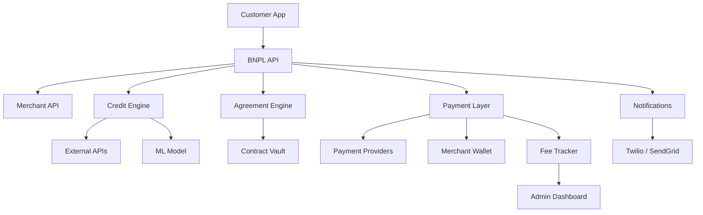
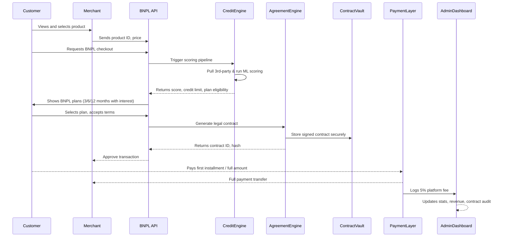

## 🌐 Design Philosophy

- **Direct Merchant Payouts**: The system **does not hold funds**; customers pay merchants directly.
- **Platform Revenue**: Comes from a **5% transaction fee**, logged and visible to admins.
- **User Credit Unlocks**: Credit is granted **gradually** as behavior and history evolve.
- **Installment Plans**: 3, 6, or 12 months with **unique interest profiles**.
- **Programmable Agreements**: Every BNPL plan is a **smart contract-like agreement**, enforceable digitally.

---

## 🧱 System Architecture (Modular View)

---

## 🧬 Core Modules Breakdown (Function-first)

### 1. **Customer App**
- Flutter app or responsive web app
- Credit dashboard, plan selection, alerts
- Eligibility UI for BNPL checkout

### 2. **Merchant API / Product Service**
- Exposes product listings
- Handles product uploads, updates, pricing
- Manages merchant configuration (e.g., available plans)

### 3. **BNPL Gateway API**
- Central coordination layer
- Authenticates requests
- Validates plan eligibility
- Orchestrates calls to:
  - Credit Scoring Engine
  - Agreement Engine
  - Payment Layer
  - Notification Service

### 4. **Credit Scoring Engine**
- Calls external sources (e.g., TransUnion, Plaid)
- Runs internal behavioral model (repayment rates, purchase frequency)
- Assigns score & spending limit
- Produces score → risk → eligible plans

### 5. **Agreement Engine**
- Dynamically generates digital contracts
- Includes:
  - Purchase value
  - Chosen plan (3/6/12 months)
  - Interest rate
  - Customer ID, product ID, timestamps
- Signed using digital signature & stored securely

### 6. **Contract Vault**
- IPFS or cloud-based object store (AWS S3, GCP)
- All contracts are tamper-proof and auditable
- Linked with customer profiles and admin logs

### 7. **Payment Relay Layer**
- Facilitates **direct payments to merchants**
- Triggers on customer action
- Calculates platform's 5% cut
- Sends fee info to the Admin Dashboard
- Refund/dispute resolution integrations

### 8. **Fee Tracker**
- Logs 5% transaction fee
- Auditable by admins
- Can be extended for tax and compliance reporting

### 9. **Admin Dashboard**
- Visualizes:
  - Active agreements
  - Platform revenue (5% logs)
  - Merchant activity & payout volume
  - Risk exposure per user/merchant

### 10. **Notification Service**
- SMS/Email for:
  - Contract confirmation
  - Payment reminders
  - Missed/late installment alerts
  - Credit limit updates

---

## 🧭 Sequence Diagram (Detailed with First Principles)

---

## ⚖️ Plan-Based Interest Logic

| Plan        | Duration | Interest Rate (example) | Applied Logic |
|-------------|----------|--------------------------|---------------|
| Lite Plan   | 3 months | 5% APR                    | Low risk      |
| Standard    | 6 months | 8% APR                    | Default tier  |
| Extended    | 12 months| 12% APR                   | Requires high score |

- Calculated in real-time based on creditworthiness
- Interest is baked into repayment contract

---

## 🔐 Security & Compliance

| Layer             | Security Practice                              |
|------------------|-------------------------------------------------|
| Auth             | JWT + OAuth2 + Biometric/2FA                    |
| Payments         | PCI DSS-compliant integrations                  |
| Contract Vault   | Encrypted S3/IPFS with hash verification        |
| Credit Data      | Masked storage + role-based access              |
| Admin Logs       | Immutable + timestamped                        |
| Privacy Laws     | GDPR, CCPA, and local compliance                |

---

## 🚀 Future Expandability

- ✅ **AI fraud detection**
- ✅ **NFC tap-to-pay integrations**
- ✅ **Partner bank underwriting support**
- ✅ **Micro-insurance at checkout**
- ✅ **Cross-border installment support**

---
